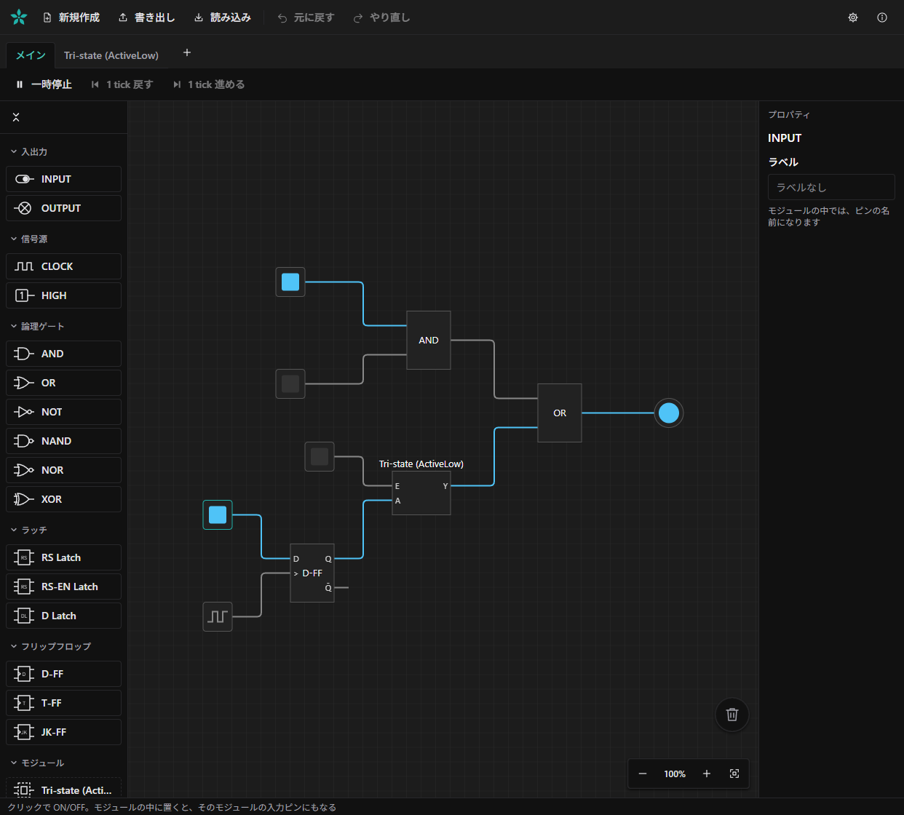

# sazanka

English | [日本語](README.ja.md)

A logic circuit simulator that runs in your browser.

The latest version is available at:  
https://marihachi.logical-flower.net/sazanka/

See the [user manual](docs/manual/README.md) (Japanese only) for how to use it.

## Community Creations

Check out the [Community Creations](docs/introduce-works/README.md) page (Japanese only) for works made by users.  
If you make something interesting, feel free to send a pull request.

## License

Available under the MIT License.

### Font license

The logo uses the `Inter SemiBold` font.  
This font is licensed under the SIL OFL.
